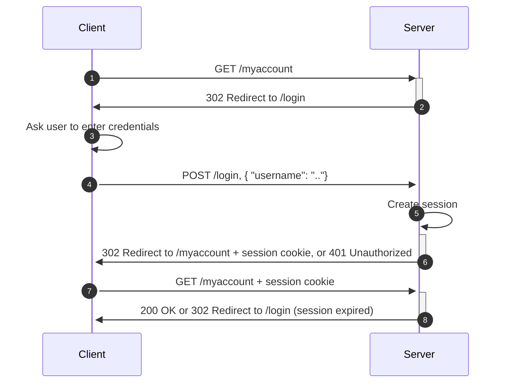

```mermaid
sequenceDiagram
    autoNumber
    Client->>+Server: GET /myaccount
    Server->>-Client: 302 Redirect to /login
    Client->>+Client: Ask user to enter credentials
    Client->>+Server: POST /login, { "username": ".."}
    Server->>+Server: Create session
    Server->>-Client: 302 Redirect to /myaccount + session cookie, or 401 Unauthorized
    Client->>+Server: GET /myaccount + session cookie
    Server->>-Client: 200 OK or 302 Redirect to /login (session expired)
```
