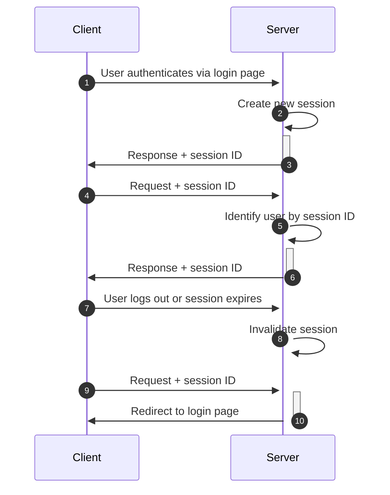

```mermaid
sequenceDiagram
    autoNumber
    Client->>+Server: User authenticates via login page
    Server->>+Server: Create new session
    Server->>-Client: Response + session ID
    Client->>+Server: Request + session ID
    Server->>+Server: Identify user by session ID
    Server->>-Client: Response + session ID
    Client->>+Server: User logs out or session expires
    Server->>+Server: Invalidate session
    Client->>+Server: Request + session ID
    Server->>-Client: Redirect to login page
```
