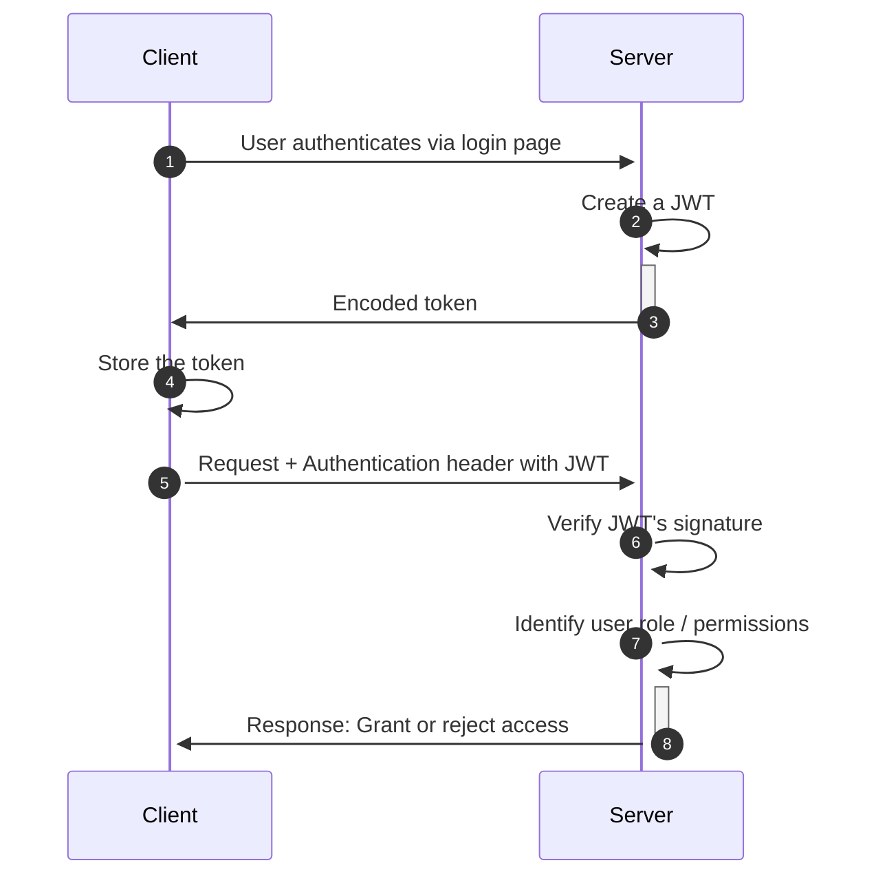

```mermaid
sequenceDiagram
    autoNumber
    Client->>+Server: User authenticates via login page
    Server->>+Server: Create a JWT
    Server->>-Client: Encoded token
    Client->>+Client: Store the token
    Client->>+Server: Request + Authentication header with JWT
    Server->>+Server: Verify JWT's signature
    Server->>+Server: Identify user role / permissions
    Server->>-Client: Response: Grant or reject access
```