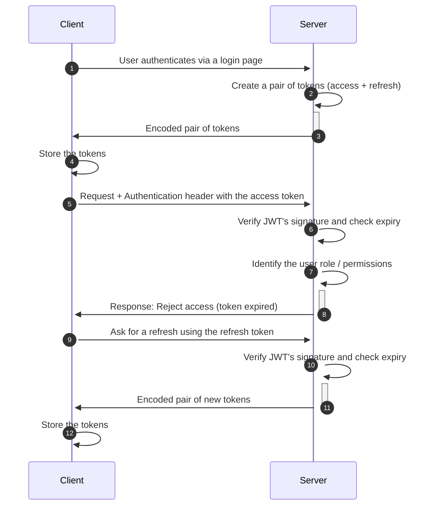

```mermaid
sequenceDiagram
    autoNumber
    Client->>+Server: User authenticates via a login page
    Server->>+Server: Create a pair of tokens (access + refresh)
    Server->>-Client: Encoded pair of tokens
    Client->>+Client: Store the tokens
    Client->>+Server: Request + Authentication header with the access token
    Server->>+Server: Verify JWT's signature and check expiry
    Server->>+Server: Identify the user role / permissions
    Server->>-Client: Response: Reject access (token expired)
    Client->>+Server: Ask for a refresh using the refresh token
    Server->>+Server: Verify JWT's signature and check expiry
    Server->>-Client: Encoded pair of new tokens
    Client->>+Client: Store the tokens
```