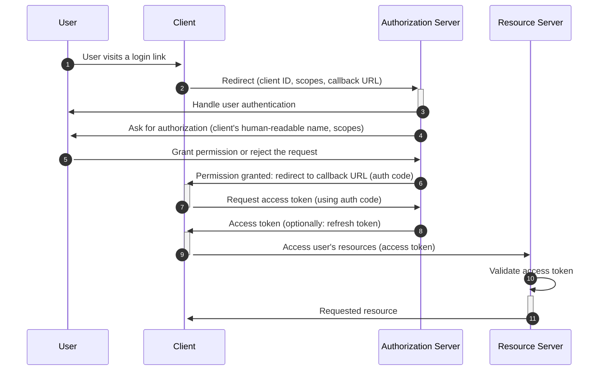

```mermaid
sequenceDiagram
    autoNumber
    User->>+Client: User visits a login link
    Client->>+Authorization Server: Redirect (client ID, scopes, callback URL)
    Authorization Server ->>- User: Handle user authentication
    Authorization Server ->>+ User: Ask for authorization (client's human-readable name, scopes)
    User ->> Authorization Server: Grant permission or reject the request
    Authorization Server ->>+ Client: Permission granted: redirect to callback URL (auth code)
    Client ->>- Authorization Server: Request access token (using auth code)
    Authorization Server ->>+ Client: Access token (optionally: refresh token)
    Client ->>- Resource Server: Access user's resources (access token)
    Resource Server ->>+ Resource Server: Validate access token
    Resource Server ->>- Client: Requested resource
```